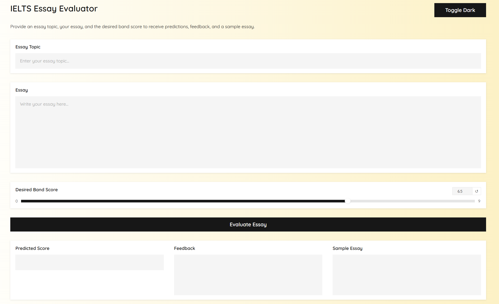

# AutoGradeMI
## Introduction
AutoGradeMI, your best IELTS writing assitant powered by GPT-4o that predicts your essay score, provides feedback, and offers improved essay sample for your desired score.

This system is the project for ECE1786: Creative Application NLP offered at the University of Toronto.

## How to use AutoGradeMI
### ***1. Start Gradio Instance:***
Run command: python ./AutoGradeMI.py

Follow local URL: http://127.0.0.1:7860 (Please check your localhost port)

### ***2. Start your IELTS Essay Grading Session:*** 
#### Put the corresponding input to the following boxes
Essay topic: The writing question, usually provided by IELTS

Essay: Your essay response

Desired Band Score: Your desired grade to get for the writing section

Click on Evaluate Essay button and start to evaluate!

### ***3. Check Output and Feedback:*** 
Check your predicted grade, feedback to improve, and learn from Sampled Essay. Let's GOOOO!
