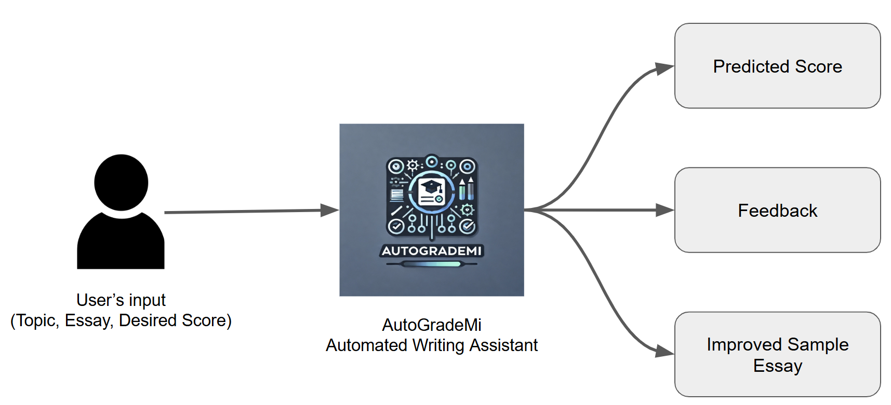
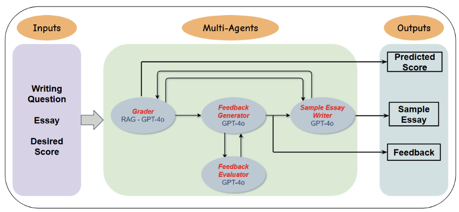

# AutoGradeMI 
## Introduction
AutoGradeMI, your best IELTS writing assitant powered by GPT-4o that predicts your essay score, provides feedback, and offers improved essay sample for your desired score.

This system is the project for ECE1786: Creative Application NLP offered at the University of Toronto.

## How to use AutoGradeMI
### ***1. Start Gradio Instance:***
Run command: python ./AutoGradeMI.py

Follow local URL: http://127.0.0.1:7860 (Please check your localhost port)

### ***2. Start your IELTS Essay Grading Session:*** 
#### Put the corresponding input to the following boxes
Essay topic: The writing question, usually provided by IELTS

Essay: Your essay response

Desired Band Score: Your desired grade to get for the writing section

Click on Evaluate Essay button and start to evaluate!

### ***3. Check Output and Feedback:*** 
Check your predicted grade, feedback to improve, and learn from Sampled Essay.

## Folders and Organizations
### ***1. Data***
***./data/processed:*** Contains cleaned and processed data in .csv and .jsonl formats. Also include train and test dataset

***./data/raw:*** Contains datasets collected from Kaggle and Hugging Face

***Other:*** In ./data, it also includes band score distribution plot and programs for data processing and analysis

### ***2. Feedback Generator and Evalutors***
***./Feedback_agent:*** The folder contains sub-folders for the feedback generator and evaluator, and IELTS rubrics and essay samples. 

***./Feedback_agent/Generator_merged:*** Attempt to merge feedback generator and evaluator as a single agent

***./Feedback_agent/Integration:*** Integrating feedback generator and evaluator, allowing to them to interact based on agentic approach

### ***3. Grader***
***./model & ./RAG:*** Models used for the Grader agent of the system. Used both fine-tuning or/and prompt engineering techniques on GPT, LLAMA, and distillBert models

RAG folder contains the algoritms for generating IELTS writing vector database using OpenAI's text-embedding-ada-002 model

### ***4. Sample Essay Generator***
***./Sample_Essay_Generator:*** Model used to generate improved sampled essay, and contains the prototype of the integration of Grader (protype using prompt engineering without RAG) agent and Sample Essay Generator

### ***5. Integration of System and Software***
***./Integration:*** Backend program that integrating all agents of system

***./AutoGRADEMI.py:*** Frontend Program that powers the UI and links frontend and backend of the system

## System Overview and Architecture

## Reference
https://www.kaggle.com/datasets/japkeeratsingh/ielts-writing

https://www.kaggle.com/datasets/mazlumi/ielts-writing-scored-essays-dataset

https://huggingface.co/datasets/chillies/IELTS-writing-task-2-evaluation/tree/main

https://huggingface.co/datasets/chillies/IELTS_essay_human_feedback/tree/main

https://huggingface.co/datasets/chillies/IELTS_evaluations

“Ielts writing band scores explained Australia,” IDP IELTS Australia, https://ielts.com.au/australia/results/ielts-band-scores/writing-band-score. 

“Ielts writing band scores canada,” IDP IELTS Canada, https://ielts.idp.com/canada/results/scores/writing. 

